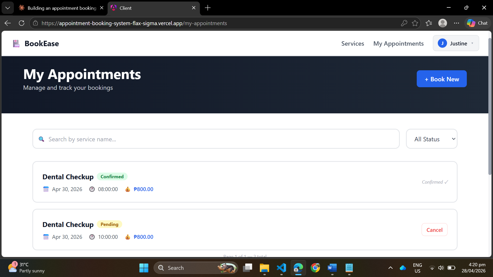
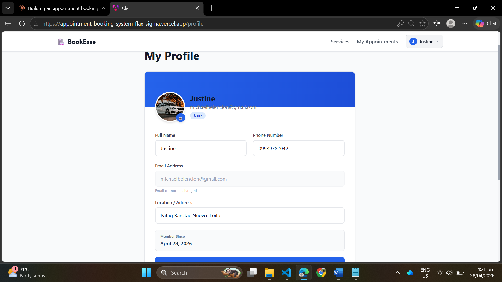
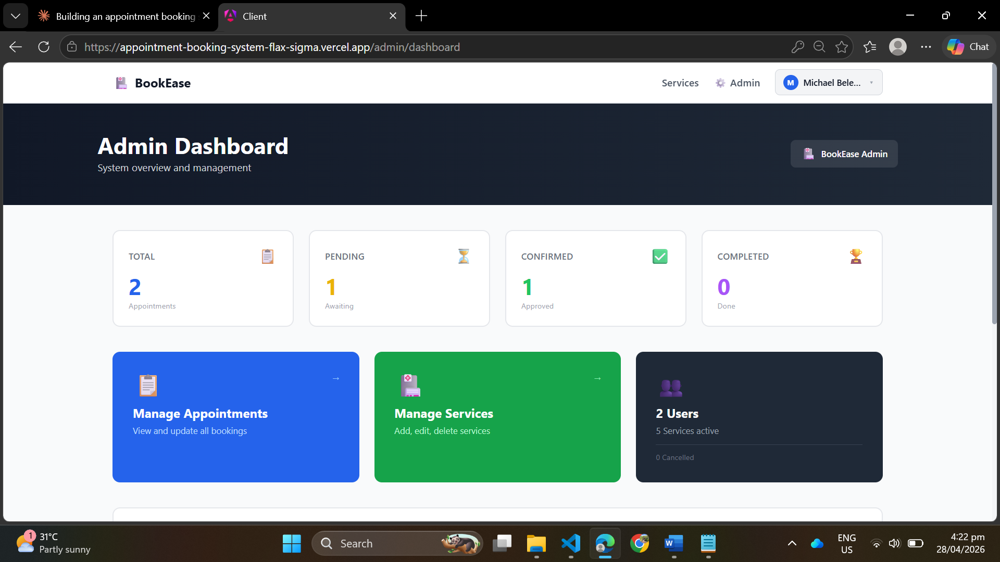

# 📅 BookEase — Appointment Booking System

## 1. Project Overview
BookEase is a full-stack healthcare appointment booking system where patients can register, browse services, and book appointments online. Admins can manage appointments, services, and users.

---

## 2. Live Links

| Service | URL |
|---|---|
| 🖥️ Frontend (Angular) | https://appointment-booking-system-flax-sigma.vercel.app |
| ⚙️ Backend API (Node.js) | https://bookease-backend-9p4b.onrender.com |
| 📚 API Documentation | https://bookease-backend-9p4b.onrender.com/api-docs |

---

## 3. Tech Stack

| Layer | Technology |
|---|---|
| Frontend | Angular 17 + Tailwind CSS |
| Backend | Node.js + Express + TypeScript |
| Database | MySQL (Railway) |
| Authentication | JWT (JSON Web Tokens) |
| File Upload | Multer |
| API Docs | Swagger / OpenAPI |

---

## 4. Setup Instructions

### Backend
```bash
cd server
npm install
npm run dev
```

### Frontend
```bash
cd client
npm install
ng serve
```

---

## 5. API Overview

| Method | Endpoint | Description | Access |
|---|---|---|---|
| POST | `/api/auth/register` | Register new user | Public |
| POST | `/api/auth/login` | Login and get JWT token | Public |
| GET | `/api/services` | Get all services | Public |
| POST | `/api/services` | Create new service | Admin |
| PUT | `/api/services/:id` | Update service | Admin |
| DELETE | `/api/services/:id` | Delete service | Admin |
| GET | `/api/appointments` | Get all appointments | Admin |
| GET | `/api/appointments/my` | Get my appointments | User |
| POST | `/api/appointments` | Book appointment | User |
| PATCH | `/api/appointments/:id/status` | Update appointment status | Admin |
| DELETE | `/api/appointments/:id` | Delete appointment | User/Admin |
| GET | `/api/users` | Get all users | Admin |
| GET | `/api/users/profile` | Get current user profile | User |
| PUT | `/api/users/profile` | Update profile + photo | User |

---

## 6. Features Implemented

| Feature | Status |
|---|---|
| User Registration & Login (JWT Authentication) | ✅ Done |
| Role-based Access Control (Admin / User) | ✅ Done |
| Book Appointments with time slot conflict detection | ✅ Done |
| Search, Filter & Pagination | ✅ Done |
| Profile with image upload (Multer) | ✅ Done |
| Admin Dashboard with statistics | ✅ Done |
| Manage Appointments (CRUD + Status update) | ✅ Done |
| Manage Services (CRUD) | ✅ Done |
| View All Users with phone & location | ✅ Done |
| Swagger API Documentation | ✅ Done |
| Responsive UI (Tailwind CSS) | ✅ Done |
| Deployed frontend & backend | ✅ Done |

---

## 7. Screenshots

### UI Screenshots

| Page | Description | Preview |
|---|---|---|
| Home | Landing page with hero section and featured services |  |
| Register | User registration form with validation |  |
| Login | Secure JWT login page |  |
| Services | Browse services with search and filter |  |
| Book Appointment | Book appointment with time slot conflict detection |  |
| My Appointments | View and manage personal appointments |  |
| Profile | Update profile with image upload |  |
| Admin Dashboard | Admin statistics dashboard |  |
| Manage Appointments | Admin appointment and user management |  |
| Manage Services | Admin service CRUD management |  |

### API Testing Screenshots

| Endpoint | Description | Preview |
|---|---|---|
| POST /api/auth/login | User login with JWT response |  |
| GET /api/services | Fetch all available services |  |
| POST /api/appointments | Book a new appointment |  |
| Swagger Docs | Full API documentation UI |  |
